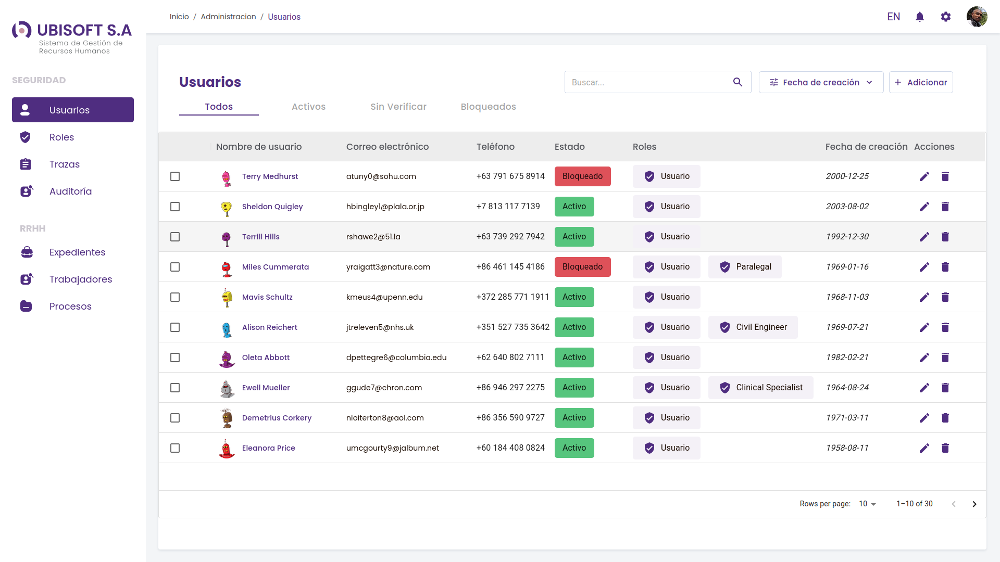

# Dofleini S.R.L Frontend technical exercise.

## Table of contents

- [Overview](#overview)
  - [The challenge](#the-challenge)
  - [Screenshot](#screenshot)
  - [Performance](#perfermance)
  - [Links](#links)
- [My process](#my-process)
  - [Built with](#built-with)
  - [Usage](#usage)
- [Author](#author)
- [Acknowledgments](#acknowledgments)

## Overview

### The challenge

The test consists of building a visual interface from scratch, following as closely as possible the guidelines defined in the design that we share with you for this purpose.
In order to evaluate not only the skills in the aforementioned area but also other general knowledge of software development (interaction with the repository, knowledge of Git, Git Flow, etc.), it is proposed to proceed as follows:

     Create a repository in the service provider of your choice (Github, Gitlab, etc) and work on it in solving the exercise.
     Use, for the solution, the following technologies: React, TypeScript, MUI, Styled emotion. If you want to propose another, you should contact us.
     You don't need to integrate with any specific backend service. Instead, work with preloaded data to simulate the behavior of the interface.

### Screenshot

### Links

- Solution URL: [Solution URL](https://github.com/adrianburgoscolas/gestion-rh)
- Live Site URL: [Live Site](https://gestion-rh.vercel.app/)

## My process

### Built with

- [React.js](https://react.dev/) - Frontend library
- Semantic HTML5 markup
- [MuiUI](https://mui.com/) - UI Framework

## Author

- Website - [Adrian Burgos: Portfolio](https://adrianburgoscolas.github.io/portfolio/)
- GitHub - [https://github.com/adrianburgoscolas](https://github.com/adrianburgoscolas)
- LinkedIn - [Adrian Burgos Full Stack Web Developer](https://www.linkedin.com/in/adrian-burgos-1776a6144/)
